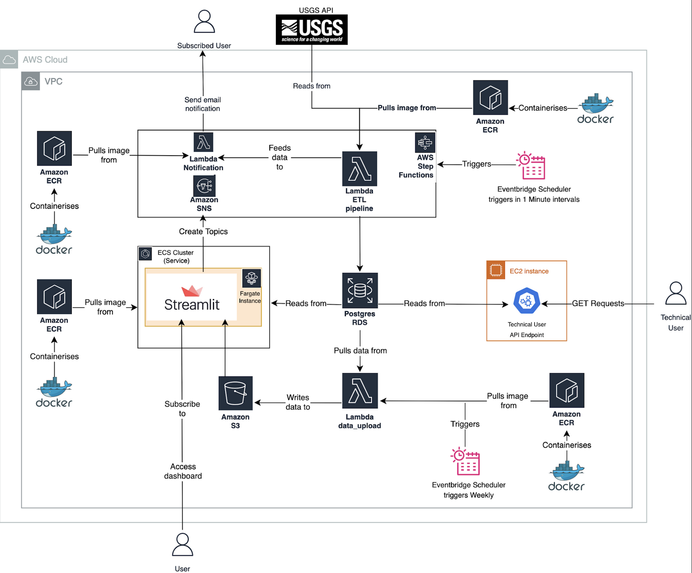
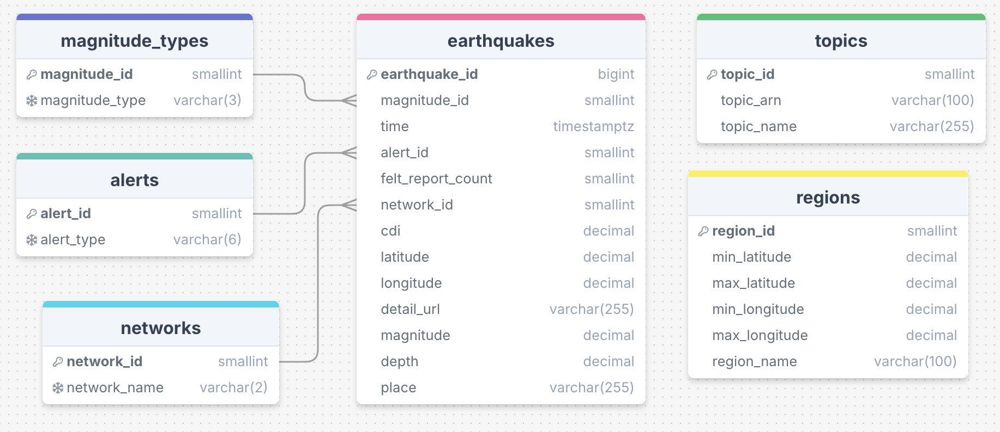

# 🌍💥 c14 Earthquake Monitor 

## 🌍 Project Overview

Earthquakes occur regularly, often with little warning, posing risks to life and property. Timely access to earthquake data, both real-time and historical, can empower individuals and organisations to make informed decisions, enhancing preparedness and response.

The Earthquake Monitor project continuously ingests real-time earthquake data from the USGS, providing users with dashboards, alerts, and reports. These tools help users stay informed, enabling timely responses to earthquake risks, and will hopefully also serve to be an effective tool for future research.

---

## 🗺️ Project Map

- dashboard
- diagrams
- pipeline
- terraform

---

## 🏗️ Project Architecture



1. **Docker + ECR for ETL Deployment:**
Using Docker allows for consistent development and runtime environments. Pushing the ETL to Amazon ECR ensures seamless integration with AWS Lambda, improving deployment speed and scalability.

2. **AWS Lambda for ETL Processing:**
Lambda provides a serverless, cost-effective solution for running the ETL every minute, ensuring high availability and automatic scaling without server management overhead.

3. **EventBridge Scheduler:**
EventBridge is used to trigger the Lambda on a strict schedule, ensuring timely data extraction and user notifications. This decouples scheduling logic from application code, improving maintainability.

4. **Amazon RDS (Postgres):**
RDS provides a managed relational database solution with automated backups, scaling, and maintenance. Postgres is chosen for its robust support for geospatial data, essential for earthquake monitoring.

5. **Amazon ECS for Streamlit Hosting:**
ECS offers scalable container orchestration to host Streamlit. This enables users to access real-time data analysis via a web interface without worrying about infrastructure scaling.

6. **EC2 for Custom API Hosting:**
EC2 provides full control over the environment for hosting a custom API. This flexibility ensures technical users can query earthquake data efficiently with tailored endpoints.

7. **S3 for Long-term Data Storage:**
S3 offers highly durable and cost-effective storage for historical earthquake data. This enables users to access historical data via Streamlit, enhancing analytical capabilities.

8. **Lambda for Weekly Reports:**
A second Lambda handles historical data archiving and report generation. It is cost-effective for periodic tasks and integrates seamlessly with SES to email reports to subscribed users.

9. **AWS Step Functions + SNS:**
Step Functions orchestrate user notification workflows, ensuring users are alerted based on custom criteria. SNS provides a scalable, easy-to-integrate solution for broadcasting notifications across multiple channels

10. **SES for Email Notifications:**
Amazon SES ensures reliable email delivery for user reports and notifications, with built-in support for monitoring delivery metrics and compliance.

---

## 📊 ERD (Entity Relationship Diagram)



1. **3NF:** Schema has been put into 3NF to eliminate redundancy, maintain data integrity, improve query efficiency which is particularly important as all queries from the API will be regarding the ```earthquake``` table.

2. **Two Separate Table Groups:** The separate ```user``` table chain was created to fulfil the requirement to allow users to subscribe to specific regions, that have been manually created, at specific magnitude values and get notifications whenever an earthquake that matches those requirements are inserted into the database.

---

## 🚀 Quick-Start Guide

Note: The following instructions are made from macOS perspective, these may not behave as expected under different operating systems.

### 📋 Prerequisites

This project mainly runs using the Python programming language. To get started, ensure you have Python 3.10 (or above) installed.

In your terminal:

**Step 1:** Clone this repo to your local machine


   ```git clone https://github.com/jiuliangut/earthquake-monitor.git```


**Step 2:** Navigate into the cloned repository:


   ```cd earthquake-monitor```


**Step 3:** Set up the virtual environment:


   ```
   python3.10 -m venv .venv
   source .venv/bin/activate
   ```

**Step 4:** Install all required dependencies from the `requirements.txt` file:


   ```pip3 install -r requirements.txt```


## Setup Overview

For a more in-depth setup, please refer to the following:

1. 🌐 **Infrastructure:**
  - To provision the resources, please navigate to the [Terraform README](./terraform/README.md) in the `terraform` folder for a detailed step-by-step guide to setting up the necessary infrastructure.

2. 🔄 **ETL Pipeline:**
  - To test the project locally, please navigate to the [Pipeline README](./pipeline/README.md) in the `pipeline' folder for details on the prerequisites, install requirements etc. as well as the dockerisation process for running the project on the cloud.


3. 🔌 **API**
  - For more technical users, please navigate to the [API README](./api/README.md) in the `api` folder for any necessary information.


4. 📊 **Dashboard:**
  - To deploy the dashboard locally or on the cloud, please refer to the [Dashboard README](./dashboard/README.md) for further guidance.

---

## 👥 Contributors

| Full Name          | GitHub Username                                           | Primary Role  | Secondary Role       |
|--------------------|-----------------------------------------------------------|---------------|----------------------|
| Jiulian Gutierrez  | [jiuliangut](https://github.com/jiuliangut)               | Data Engineer | Project Manager      |
| Jakup Poskrop      | [Jakub-Poskrop](https://github.com/Jakub-Poskrop)         | Data Engineer | Quality Assurance    |
| Qasim Rafiq        | [qrafiq1](https://github.com/qrafiq1)                     | Data Engineer | Quality Assurance    |
| Fahad Rahman       | [Fahi28](https://github.com/Fahi28)                       | Data Engineer | Architect            |
| Krishna Seechurn   | [S1mpySloth](https://github.com/S1mpySloth)               | Data Engineer | Architect            |