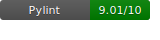

# c14 Earthquake Monitor

## Project Overview

Earthquakes occur regularly, often with little warning, posing risks to life and property. Timely access to earthquake data, both real-time and historical, can empower individuals and organizations to make informed decisions, enhancing preparedness and response.

The Earthquake Monitor project continuously ingests real-time earthquake data from the USGS, providing users with dashboards, alerts, and reports. These tools help users stay informed, enabling timely responses to earthquake risks, and will hopefully also serve to be an effective tool for future research.

---

## Project Map

- dashboard
- diagrams
- pipeline
- terraform

---

## Project Architecture

1. **Docker + ECR for ETL Deployment:**
Using Docker allows for consistent development and runtime environments. Pushing the ETL to Amazon ECR ensures seamless integration with AWS Lambda, improving deployment speed and scalability.

2. **AWS Lambda for ETL Processing:**
Lambda provides a serverless, cost-effective solution for running the ETL every minute, ensuring high availability and automatic scaling without server management overhead.

3. **EventBridge Scheduler:**
EventBridge is used to trigger the Lambda on a strict schedule, ensuring timely data extraction and user notifications. This decouples scheduling logic from application code, improving maintainability.

4. **Amazon RDS (Postgres):**
RDS provides a managed relational database solution with automated backups, scaling, and maintenance. Postgres is chosen for its robust support for geospatial data, essential for earthquake monitoring.

5. **Amazon ECS for Streamlit Hosting:**
ECS offers scalable container orchestration to host Streamlit. This enables users to access real-time data analysis via a web interface without worrying about infrastructure scaling.

6. **EC2 for Custom API Hosting:**
EC2 provides full control over the environment for hosting a custom API. This flexibility ensures technical users can query earthquake data efficiently with tailored endpoints.

7. **S3 for Long-term Data Storage:**
S3 offers highly durable and cost-effective storage for historical earthquake data. This enables users to access historical data via Streamlit, enhancing analytical capabilities.

8. **Lambda for Weekly Reports:**
A second Lambda handles historical data archiving and report generation. It is cost-effective for periodic tasks and integrates seamlessly with SES to email reports to subscribed users.

9. **SES for Email Notifications:**
Amazon SES ensures reliable email delivery for user reports and notifications, with built-in support for monitoring delivery metrics and compliance.

---

## ERD (Entity Relationship Diagram)

---

## Setup Overview

1. **Infrastructure:**
   - To provision the resources, please navigate to the [Terraform README](./terraform/README.md) in the `terraform` folder for a detailed step-by-step guide to setting up the necessary infrastructure. 

2. **ETL Pipeline:**
   - To test the project locally, please navigate to the [Pipeline README](./pipeline/README.md) in the `pipeline' folder for details on the prerequisites, install requirements etc. as well as the dockerisation process for running the project on the cloud. 

3. **Dashboard:**
   - To deploy the dashboard locally or on the cloud, please refer to the [Dashboard README](./dashboard/README.md) for further guidance.

---

## Contributors

Project Manager: [jiuliangut](https://github.com/jiuliangut)
Quality Assurance: [Jakub-Poskrop](https://github.com/Jakub-Poskrop)
Quality Assurance: [qrafiq1](https://github.com/qrafiq1)
Architect: [Fahi28](https://github.com/Fahi28)
Architect: [S1mpySloth](https://github.com/S1mpySloth)
