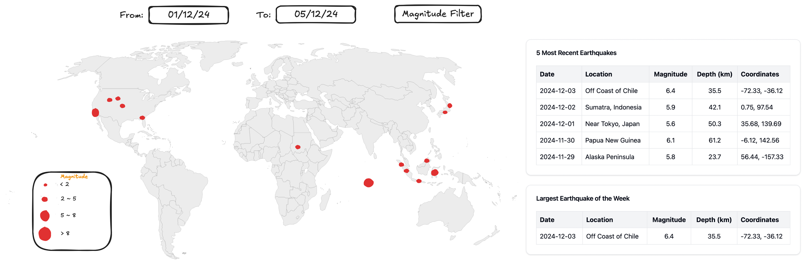

# 🌏 Earthquake Monitor System 🌍
Welcome to the Earthquake Monitor System, a real-time dashboard and subscription service designed to monitor earthquakes globally and provide timely alerts based on user preferences.

## 🚀 Introduction
The Earthquake Monitor Dashboard enables users to explore and interact with earthquake data. With features like world map visualizations, detailed tables, and PDF report downloads, the dashboard provides a powerful tool for tracking seismic activity.

---

## 🖼️ Wireframe



1. **World Map** that will have red dots signifying earthquakes, the larger the dot the greater the magnitude of the earthquake.

2. **Date filtering** so that users can see earthquakes that have happened within a specific time frame.

3. Tables that will show the **5 most recent earthquakes** and another that will show the **largest earthquake of the week**.

## 🛠️ Features
### 1️⃣ Dashboard
- View earthquake data from selected date ranges.
- Visualize earthquakes on a dynamic interactive world map.
- Filter earthquakes by minimum magnitude.
- 
See details of:
- Recent Earthquakes
- Biggest Earthquake of the Week
### 2️⃣ Subscription Service
- Subscribe to earthquake alerts via Email, Phone, or Both.
- Set preferences:
  - Select specific regions.
  - Choose minimum magnitude thresholds (e.g., noticeable or strong earthquakes).
### 3️⃣ Download Weekly Reports
Download the weekly earthquake report as a PDF directly from AWS S3.

 
## 🚀 Getting Started
Prerequisites
- Python 3.9+
- Required Python packages:
  ``` pip install -r requirements.txt```

## Running the App

1. Dashboard

    ```streamlit run earthquake_dashboard.py```

 2. Subscription Page
   
    ```streamlit run subscribe_page.py```

## 📋 How to Use
### 1️⃣ Dashboard
**Sidebar**
- Download the weekly earthquake report as a PDF.
  
**Filters**
- Date Range: Select start and end dates for earthquake data.
- Minimum Magnitude: Use the slider to adjust the minimum magnitude.
  
**Data Display**
- View filtered data in a table.
- Visualize data on the interactive map, with tooltips displaying:
  - Location
  - Time
  - Magnitude
  - Depth

### 2️⃣ Subscription Page
**Form**
- **Enter your details:**

  - First and last name.
  - Contact information (Email and/or Phone).
  - Regions of interest.
  - Minimum magnitude threshold for alerts.
  - Submit: Click "Subscribe" to register for alerts.

**Validation**
- Name must contain only alphabetic characters.
- Email must follow standard email formatting.
- Phone numbers must:
  - Start with 07.
  - Contain 10 or 11 digits.

**Contact Preferences**
- Email: Receive alerts via email.
- Phone: Receive SMS alerts.
- Both: Get alerts on both platforms.

## ⚙️ Environment Variables
Ensure the following environment variables are set in a .env file:
```
ACCESS_KEY_ID=your_aws_access_key
SECRET_ACCESS_KEY=your_aws_secret_access_key
```

## 🌍 AWS S3 Integration
- Bucket Name: c14-earthquake-monitor-storage
- Weekly Report: PDFs named in the format <YYYY-MM-DD>-data.pdf.

## 📈 Visualization
- Built using Streamlit and PyDeck for interactive data visualization.
- Dynamic earthquake data rendered on a scatterplot map with customizable filters.